# HOMIQ Flowcharts

These diagrams describe the intended path from an empty repository to a finished HOMIQ V1 and the main owner workflows.

## 1. End-to-end development flow

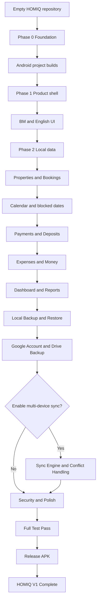

## 2. Owner daily workflow

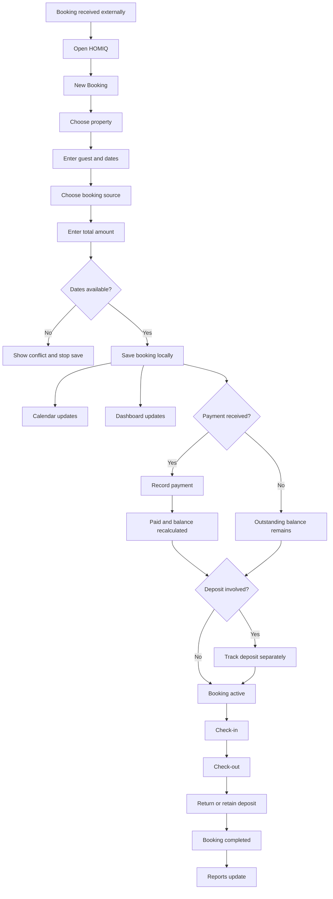

## 3. Local-first data architecture

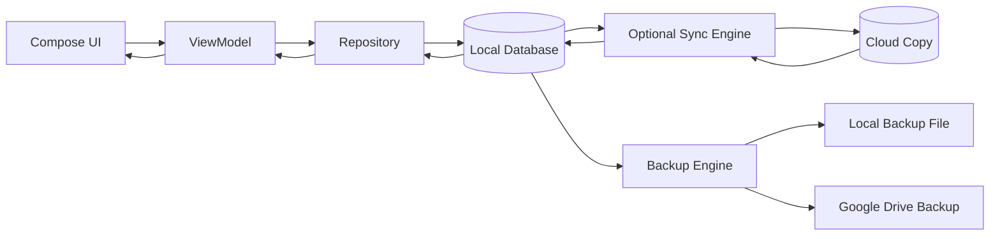

Rule: the core owner workflow reads and writes locally first. Cloud and Drive are optional layers.

## 4. Backup versus sync

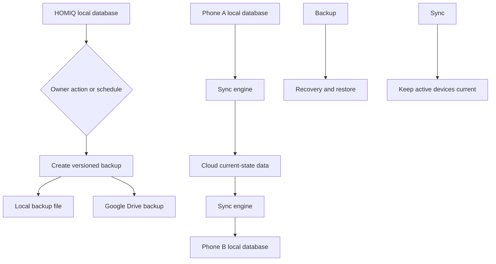

## 5. First launch target

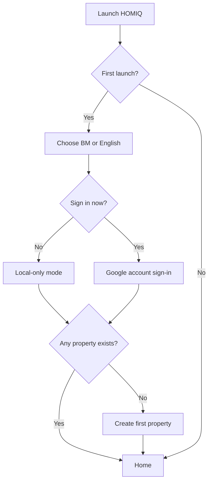

## 6. New booking target

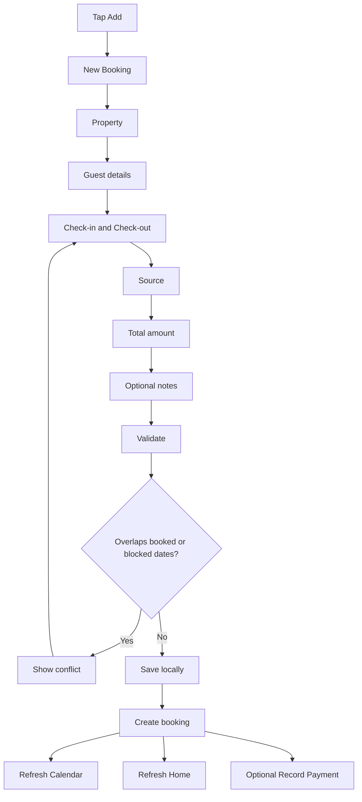

## 7. Payment and deposit target

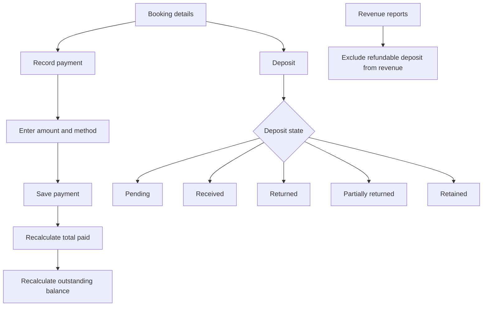

## 8. Expense and profit target

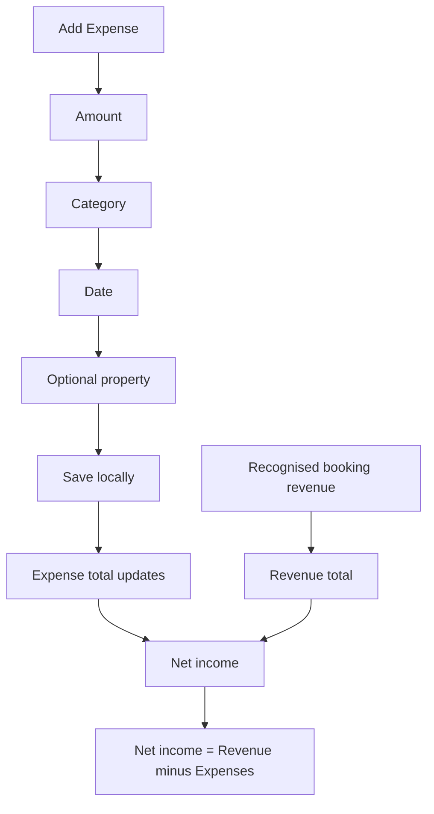

## 9. Multi-device sync target

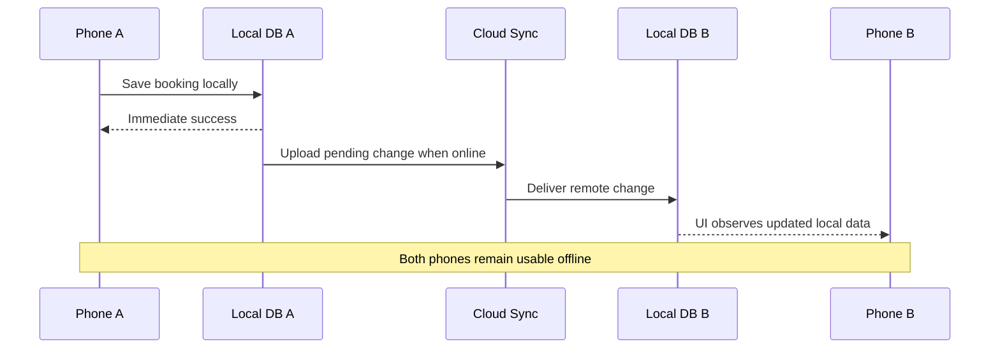

## 10. Restore target

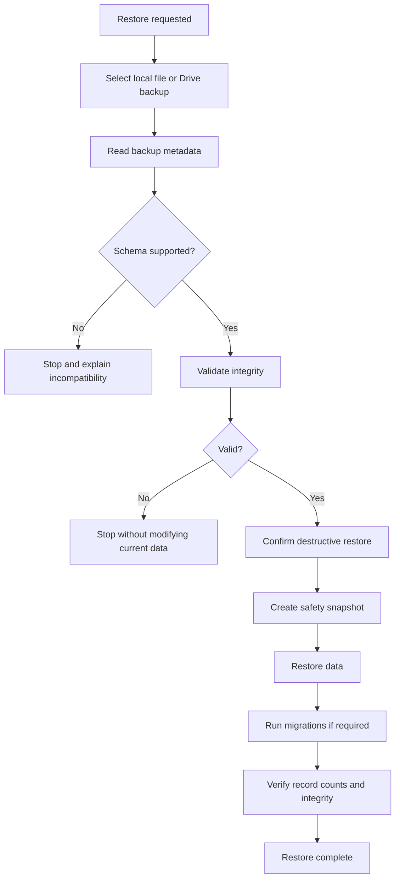

## 11. V1 completion gate

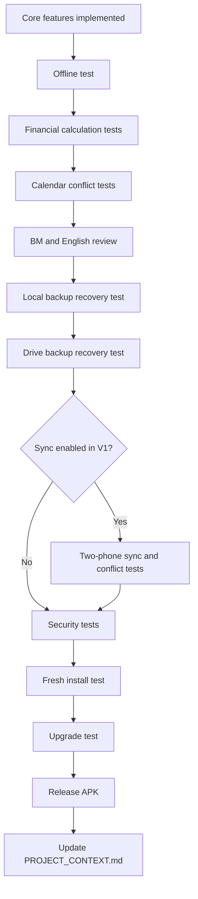
